# MusicVault : a revolutionary platform that connects music creators with the power of Web3.


## Introduction

MusicVault is a revolutionary platform that breaks down the barriers between Web2 and Web3 by providing seamless communication and management tools for music creators and fans alike.  MusicVault allows for the **complete management of a music product's entire lifecycle** from creation to distribution and monetization. Also MusicVault is capable to **foster real-time interaction** between creators and fans through the Web3MQ chatroom feature, which creates a truly collaborative and inclusive environment. 

MusicVault is not just a platform that covers the entire lifecycle of music, it is also a decentralized one. Through the use of **IPFS, Particle Network and Web3MQ** technology, MusicVault has achieved **maximum data decentralization and privacy** while maintaining a Web2 user experience. In addition, anonymity is also preserved on the platform.

**The project is registered on Track SocialF(For the social interactions and financing), and Infra & Scalability, and bounties of Web3MQ and Particle Network are applied.Check the following introduction for more details if needed.**

- [Contract Introduction](soundvaultcontracts/README.md)
- [DAPP Introduction](soundvault-dapp/README.md)

## Aim

At MusicVault, our vision is to be a web3 music platform that connects content creators and fans. We enable creators to produce and sell their music for profit while also providing a platform for fan engagement through membership clubs. In summary, the musicVault smart contract enables a complete music ecosystem, providing creators and users with a secure, transparent, fair, and efficient platform for music transactions and interactions.

## Target Users

MusicVault is designed for three types of users: creators, music enthusiasts, and investors in the cultural and creative industry. This is because the services and features of the MusicVault platform aim to meet the needs of these three types of users, who are an indispensable part of the music ecosystem.

- Creators : Creators are the core users of the platform, as they are the creators and copyright holders of music works. The platform provides them with a range of features to manage their works and copyrights, and connects their works directly with fans, thereby better promoting their artistic creation.

- Music enthusiasts : Music enthusiasts are very important users in the music ecosystem, as they are consumers and promoters of music works. The platform provides them with a way to directly obtain music works from creators, and they can also interact with creators and other fans through the platform's social features, thereby better supporting and promoting the music they like.

- Investors : Investors in the cultural and creative industry are important participants in the music industry, as they support and promote music works and creators through investment. The platform provides them with a direct way to invest in music works and creators, and uses blockchain technology to ensure transparency and security in copyright and revenue distribution.

## Features And Edges

### Comparing with Web2 Music Platform

- Copyright Management: The smart contract can manage the copyright information of music works, such as ensuring that only authorized users can purchase and use music works. In addition, the smart contract can also manage the copyright revenue allocated to artists and other collaborators.
- Automated Allocation: The smart contract can automatically distribute sales revenue to relevant parties, such as composers, lyricists, performers, producers, etc., based on preset allocation rules. This will greatly simplify the process of copyright distribution.
- User reputation management: Users' interaction history with the platform determines their reputation, incentivizing users to use and provide feedback on the platform, while introducing quadratic voting to limit centralization.
- NFT Issuance: Creators can convert their music works into NFTs for ease of collection and trading.
- Donations/Airdrops: Users can donate to creators and creators can set criteria for airdrops of their works.

### Comparing with Web3 Music Platform

- Fan Clubs Chats : Creators can create and manage their fan clubs and interact with fans through smart contracts. Instant Message is enabled to implement real-time messaging.
- Easy Login : Web2 Auth is also intergrated to ease the login for web3 newcomers. This can reduce the threshold and help the community grow.
- Web2 Interaction Experience : Fluent and Smooth

## Future Plans

Our goal is to continue developing and improving MusicVault as a decentralized music platform to empower creators and fans in the music industry.

- Build a strong community: Engage with users, influencers to create a community around the platform. Provide opportunities for users to share feedback and ideas, and actively incorporate their input into future developments.
- Expand partnerships: Collaborate with other companies and organizations in the music industry to expand the reach and impact of the platform. This can include streaming services, music festivals, and more.
- Develop new features: Continuously innovate and add new features to the platform to keep users engaged and attract new ones. This can include things like advanced analytics, social features, and more.
- Increase marketing efforts: Develop a strong marketing strategy to raise awareness of the platform and attract new users. This can include digital marketing, influencer partnerships, and more.
- Embrace new technologies: Stay up-to-date with the latest technologies and trends in the music industry, and incorporate them into the platform to provide users with the best possible experience. This can include things like AI music composition, and more.

## Design

The initial design is shown below :

- Backend (on chain) : Currently, there is no web2 server. All data is stored on chain
- Storage : Music is stored on IPFS
- DAPP : dapp is written using react, specifically next.js framework

## Develop

Develop process is from 23/04/2023 - 13/05/2023. More detailed info can be checked in [Develop.md](docs/develop.md)

## Project Display

### Deploy

The deploy onto BSC testnet is below:

- <a href="https://testnet.bscscan.com/address/0x5AD657a48A4b602c51F5Bf1028c377270C06C168">musicVault</a>

- <a href="https://testnet.bscscan.com/address/0x1d534361F6542B608e831fcA2aE8237182450c79">fanNFTFactory</a>

- <a href="https://testnet.bscscan.com/address/0xc294f24Da535bA5c28F560921BFF6bdF15d7df6F">vaultNFT</a>

- <a href="https://testnet.bscscan.com/address/0xF0Fc1ac7D0b44feFf30676966d23b4Cea14F82e4">vaultToken</a>

  

All the contract are all verified.

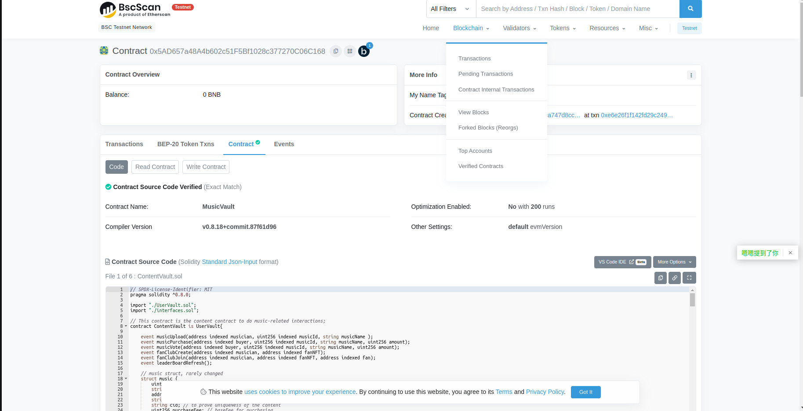

### Page View

#### Dashboard

This is the main page. In this page, the general information of musicvault is shown.

Before login, the information are not retrieved from blockchain. User can click on Button [Connect Wallet] to login.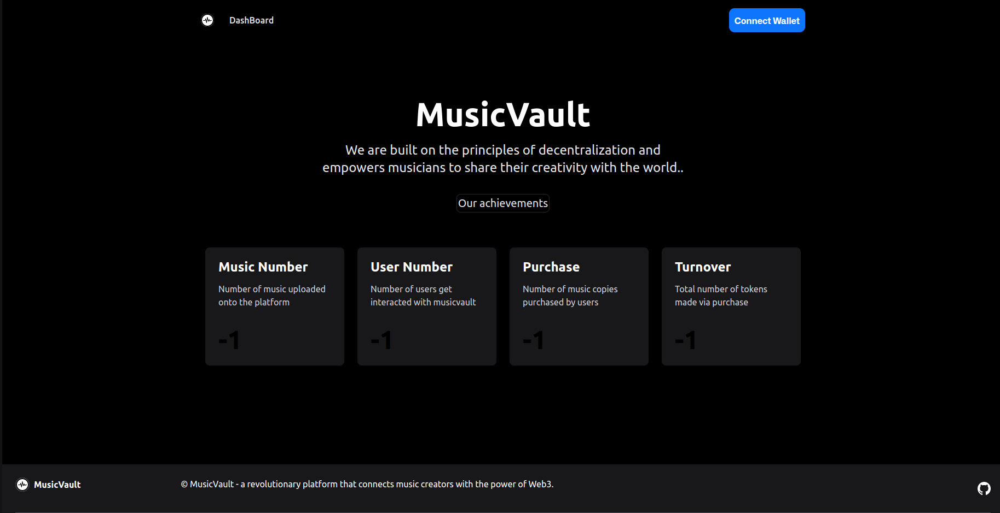

Several login methods are enabled, users can choose different kinds of login methods, including

- Web2 Login (via Particle Auth)
  - Email
  - Phone
  - Google Auth2
  - ...
- Wallet Login
  - Metamask
  - WalletConnect
  - ...

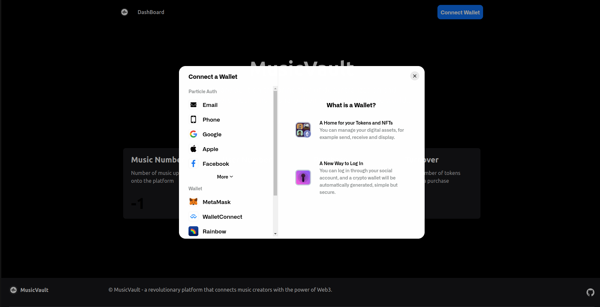

After logging in, the provider can be got and injected into the enviroment.  Information are fetched from chain using the provider, and the navigation bar has been updated. 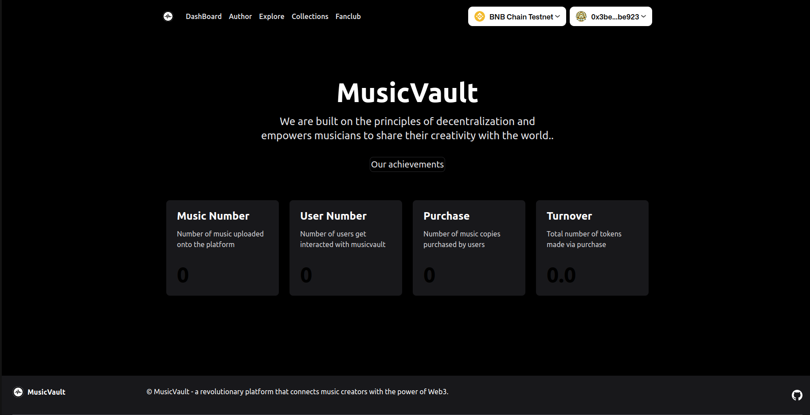

Specially, when using Web2 auth, a wallet panel will also appear on the screen. You can close or open it by clicking the circle.

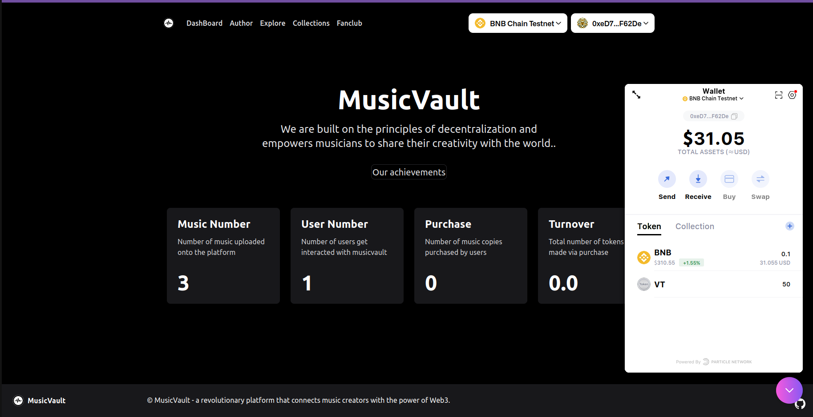

#### Author

Author page is for creator, who can create music(including uploading to ipfs and register on chain), create fanclub(**this will create a fangroup channel in Web3MQ**)


After Clicking on create fanclub, users are asked to confirm the transaction and signing process is also required. After creation, the button will change to the nft contract created. Also, at this time, a chat group will also be created.

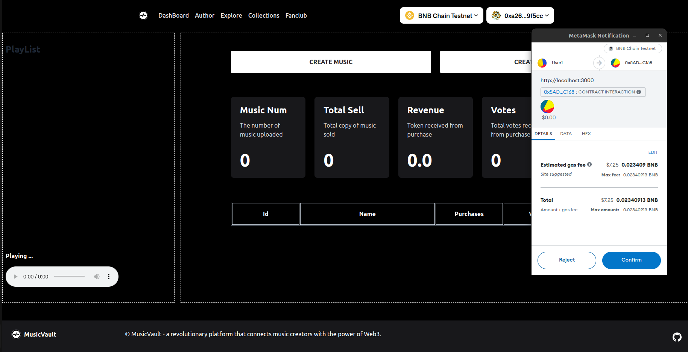

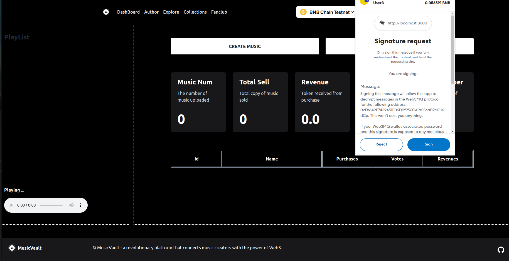


After Clicking on create music, users are asked to fill the form and upload the music file to be uploaded. Some time is required as this involves the upload through IPFS gateway. After succesfully created, the music information will be updated. Creators will be able to trace the statistics of the created work.

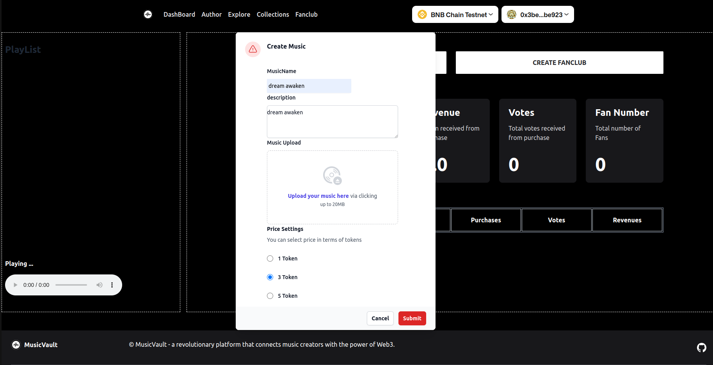

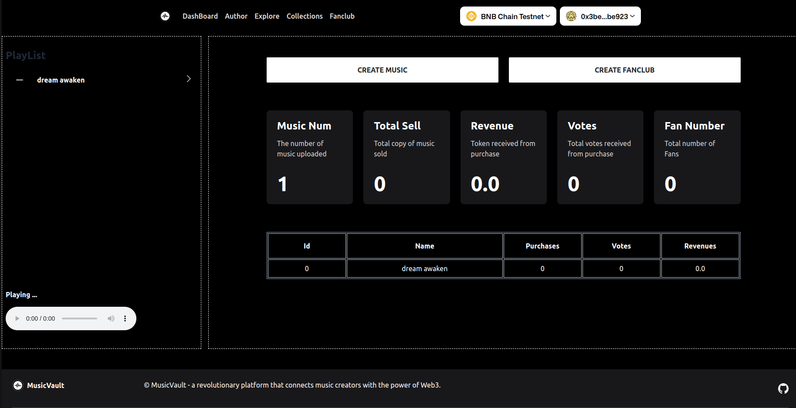

By clicking music on the playlist, the music will be downloaded and played.


#### Explore

Explore page is used for users to find musics. On the left, there is a leader board of purchase and a leader board of vote. On the right there are list of music, describing the information of music on  sold.

A user can only purchase and vote a certain music once (automatically done for the music's creator). 

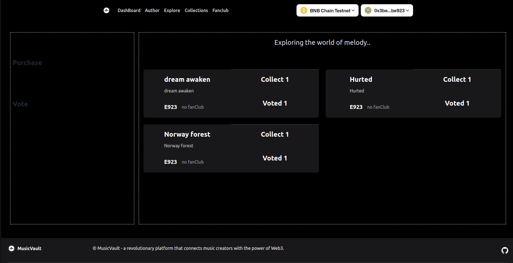

For a user, he can buy several copies of a music or vote several votes to get it listed on the leader board. But the max number of actions relies on his credit point. And the project uses quardratic voting to limit centralization (prevent a whale has overwhelming influence over others).

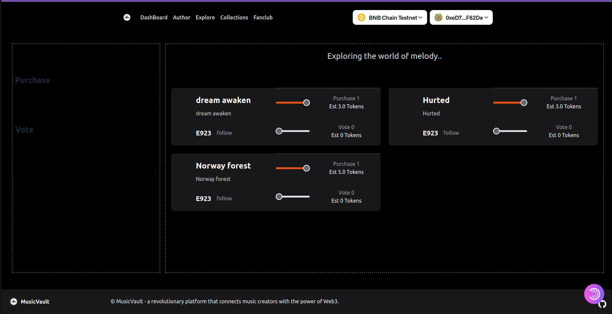

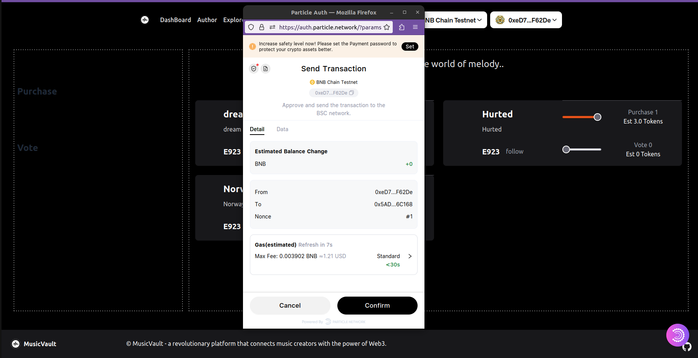

After purchase, the information has been updated. The music is on the leaderboard and the user's credit point has increased. 

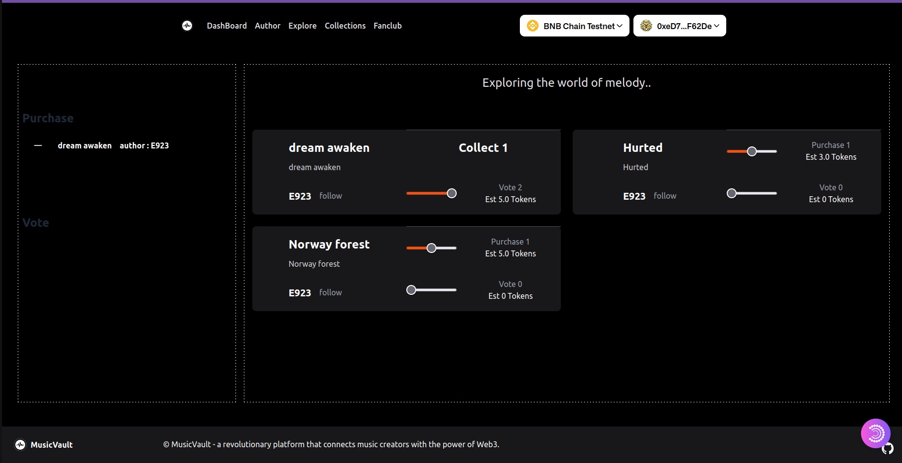

After 2 votes, the music is also listed on the vote leader board.

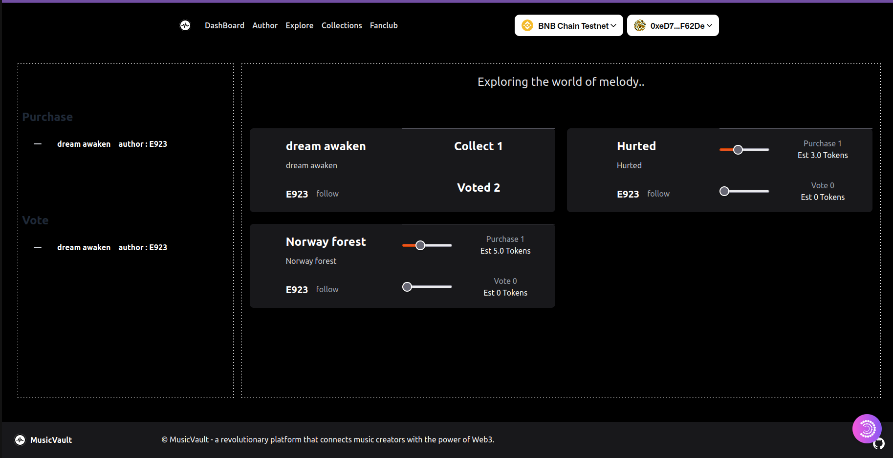

Once a music is purchased, the user can follow the corresponding author to join his fanclub.

After each purchase or vote, the information of author page will also change for music creator.

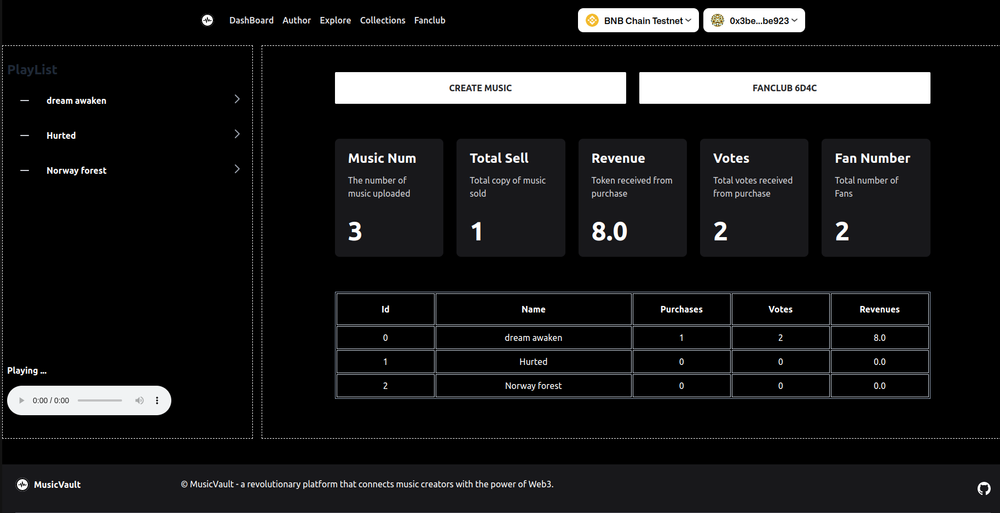

#### Collection

Collection page shows all the music the user collected via create or purchase. Some similar procedures could be done here as well as in Author page and Explore page.

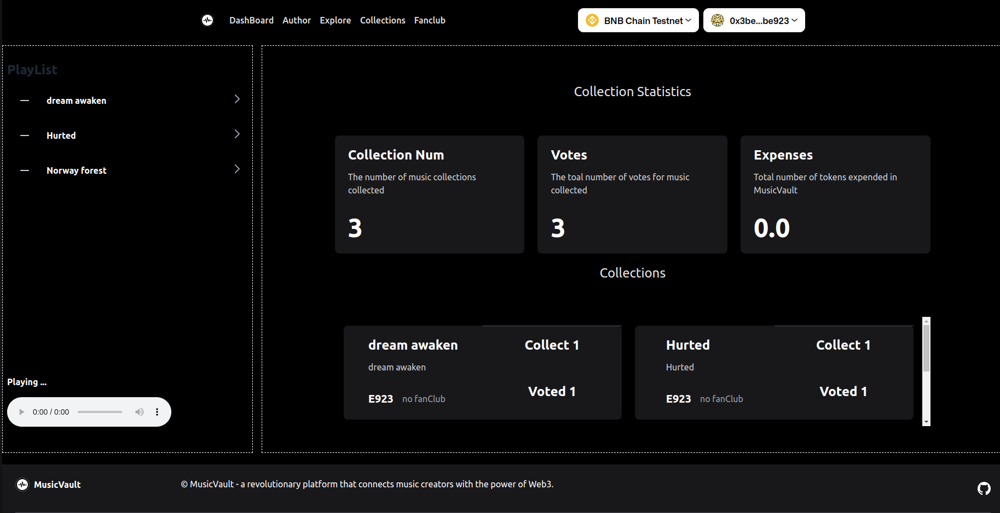

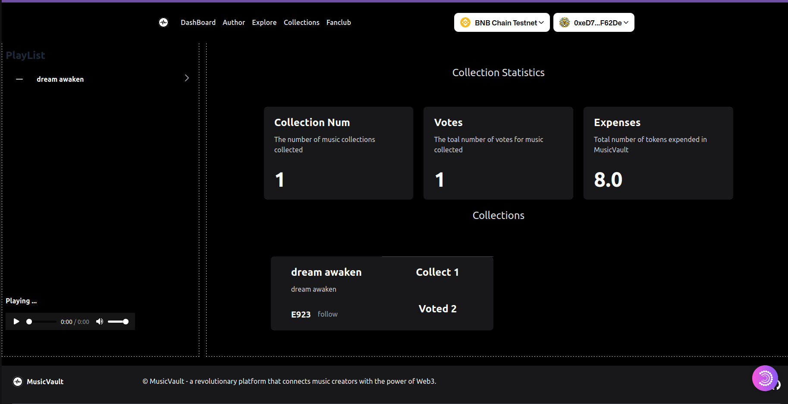

#### Fanclub

Fanclub enables the users to chat with each other under a certain fanclub chat. This is supported by **Web3MQ** and is almost instant message.

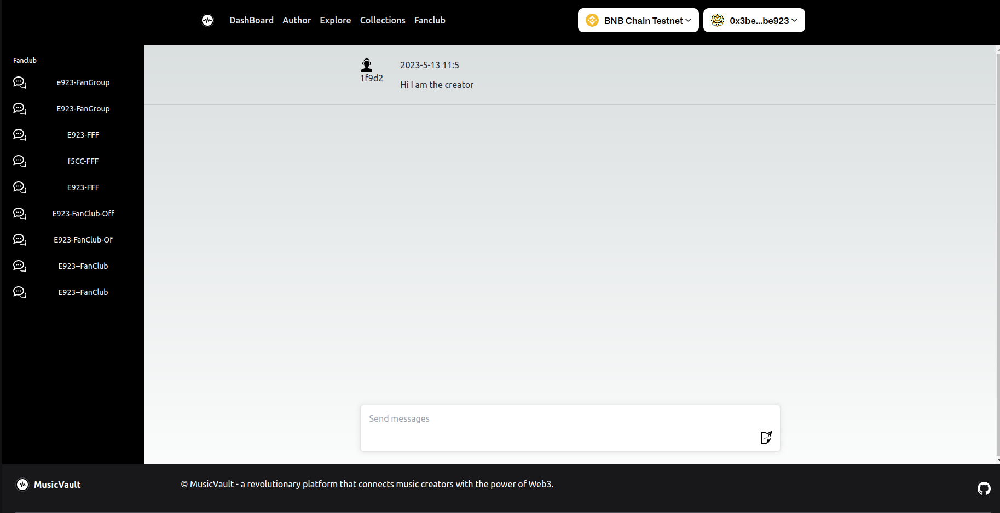

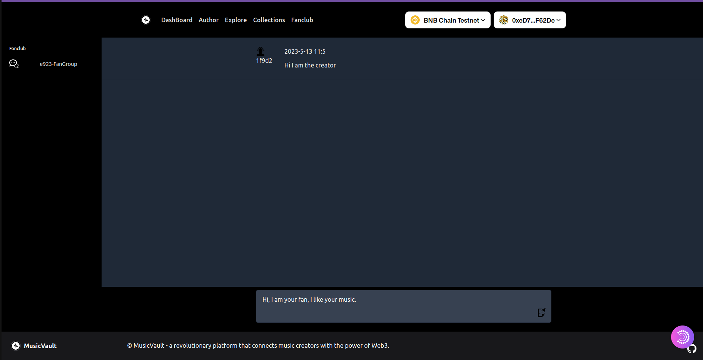

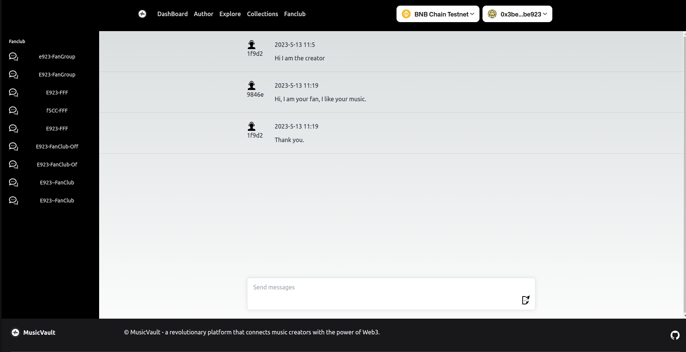


## Bounty - Particle Network

This project uses particle network mainly for 2 uses:

- By utilizing diverse authentication methods, MusicVault bridges the gap between Web2 and Web3 and reduces the barriers to user acquisition. Google Auth2, github, phone number could also be used for users to enter as a web2 vistor but still can keep his assets safe. 

- With the IPFS-based SDK and gateway, MusicVault enables rapid file uploading.

My Experience:

- The intergration of Particle Network is good, I can use the component to directly perform the function with little editing.
- The Particle Auth is actually good. When signing in with email, it's actually the same. **This is why i want to use Particle Network : Fast and Convenient**

Some FeedBack:

- Need a fast way to reset user's password in the official website. It's not that easy to get a lot of web2 accounts. This could be more dev-friendly.
- MPC wallet is somehow different from common wallet(eg. different signing result), may be can stress this somewhere in the document.

## Bounty - Web3MQ

This project uses web3MQ for 2 uses:

- Chatroom : **Web3MQ connects creators and fans through chat rooms, which not only increases user stickiness but also provides a more user-friendly Web2-like experience, reducing the customer acquisition threshold.** I have always thought that if third-party hosted wallets and message queues can be linked together, it will be a great experience in WEB3!
- Pub/Sub : A creator can positively push notifications to his fans to notify the progress of a certain event. But due to the lack of time, It has not been implemented yet.

My Experience:

- I received a huge support from Web3MQ. Huge thanks to their kindness and their devotion. 
- The result is good, I never expect it to work that quickly and smoothing. **Web3MQ gives my the experience of WEB2 while i could still get my privacy protected. ** 

Some FeedBack:

- Official Document could be improved a little bit.
- The support for MPC wallet can be reinforced.

Below is my example function to login and get instance, hope this will help

```javascript
// params = {"account":account,"signer":signer}
const login = async (params) => {
	
	// can define it here or get it from params(user)
    const password = Web3MQApi.password; 

    const didType = 'eth' // or 'starknet';
    const didValue = params.account;
    let instance;


    const bestEndpointUrl = await Client.init({
        connectUrl: '', //
        app_key: Web3MQApi.appId, // temporary authorization key obtained by applying, will be removed in future testnets and mainnet
    });


// 1. connect wallet and get user
    const {userid, userExist} = await Client.register.getUserInfo({
        did_value:  didValue,
        did_type: didType,
    });

	// keypairs should be stored in localstorage (or database) to bypass signing process for speed
    let publicKey = localStorage.getItem(didValue+"pub") || "";
    let secretKey = localStorage.getItem(didValue+"sec") || "";

    if (publicKey!=""){
        const {
            tempPrivateKey,
            tempPublicKey,
            pubkeyExpiredTimestamp,
            mainPrivateKey,
            mainPublicKey,
        } = await Client.register.login({
            password,
            mainPublicKey: publicKey,
            mainPrivateKey: secretKey,
            userid,
            didType,
            didValue,
        });
    
        const keys = {
            PrivateKey: tempPrivateKey,
            PublicKey: tempPublicKey,
            userid: userid
        };
        
        console.log("login with pubkey and secret saved");
        instance = Client.getInstance(keys);
    }else{
   // 2. create main key pairs

		// get signcontent from website
        const {signContent} = await Client.register.getMainKeypairSignContent({
            password: password,
            did_value: didValue,
            did_type: didType,
        });
		
		// sign it with signer
        const signature = await ((params.signer).signMessage(signContent));
		
		// get keypairs (should be same every time, but not for MPC)
        const {publicKey, secretKey} = await Client.register.getMainKeypairBySignature(
            signature,
            password
        );
		
        if (!userExist) {
            console.log("registering ...");
            const {signContent} = await Client.register.getRegisterSignContent({
                userid,
                mainPublicKey: publicKey,
                didType,
                didValue,
            });

            console.log("Sign msg for register")
            const signature = await (params.signer).signMessage(signContent);

            const did_pubkey = '';
            
            const registerParams = {
                userid,
                didValue,
                mainPublicKey: publicKey,
                did_pubkey,
                didType,
                nickname: '',
                avatar_url: '',
                signature,
            };


            const registerRes = await Client.register.register(registerParams);
        }
       
       // store the pub/sec key pair 
        localStorage.setItem(didValue+"pub",publicKey);
        localStorage.setItem(didValue+"sec",secretKey);
        console.log("save publicKey");

        const {
            tempPrivateKey,
            tempPublicKey,
            pubkeyExpiredTimestamp,
            mainPrivateKey,
            mainPublicKey,
        } = await Client.register.login({
            password,
            mainPublicKey: publicKey,
            mainPrivateKey: secretKey,
            userid,
            didType,
            didValue,
        });

        const keys = {
            PrivateKey: tempPrivateKey,
            PublicKey: tempPublicKey,
            userid: userid
        };

        console.log("login with pubkey and secret requested via signing");
        instance = Client.getInstance(keys);
    }
    return instance;
}
```


## Todo

As I am working alone after work, some interesting features should be (not yet) implemented, but they will eventually come. These points include:

- Improve User reputation management module
- Map user with web2 social identity for DID design
- Empower on vaultToken with a certain mechanism

- UI Design : I am not an official front-end developper, so some UI design is just rough drafts. Should be improved later for better performance.
- Interactions : Some functions including donation and airdrop are not fully realized in dapp due to time issues.
